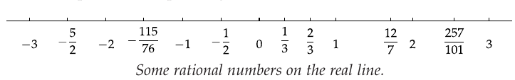
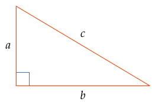

# Introduction

## Origins of Algebra

- **Mesopotamia and Egypt (c. 2000–1600 BCE)**
  - Early problem-solving (linear/quadratic equations) in word problems
  - No formal symbols, but systematic procedures
- **Greek Era (c. 600 BCE–300 CE)**
  - Geometric methods for solving equations (Euclid, Apollonius)
  - Diophantus introduced proto-symbolic notation
- **Islamic Golden Age (8th–12th Century)**
  - Al-Khwarizmi's work *Al-jabr* $\rightarrow$ term "Algebra"
  - Systematic solutions for linear and quadratic equations
- **Transmission to Europe (12th–17th Century)**
  - Latin translations influenced Fibonacci, others
  - Viète, Descartes established modern symbolic notation and analytic geometry
- **Modern Algebra (19th–20th Century)**
  - Emergence of abstract algebra (groups, rings, fields)
  - Galois, Abel, and others formalized algebraic structures

## What is Algebra?

Algebra is a branch of mathematics that deals with numbers, variables, and
their relationships. Key concepts include:

- **Variables** — symbols (like $x$, $y$) representing unknown or changing values.
- **Expressions** — combinations of variables, numbers, and operations. E.g., $2x + 3$.
- **Equations** — mathematical statements that express equality, e.g., $2x + 3 = 7$.
- **Solving equations** — finding values for variables that make an equation true.
- **Polynomials** — expressions like $3x^2 + 2x - 5$ involving variables raised to powers.
- **Functions** — describes a relationship between variables, e.g., $y = 2x + 1$.

## Why Algebra is Important in Machine Learning

- **Data representation.** Data is often represented as vectors, matrices, and
  tensors. Algebra provides the tools for efficiently handling these
  structures.
- **Model building.** Many machine learning models (e.g., linear regression,
  neural networks) rely on algebraic operations like matrix multiplication
  and linear transformations.
- **Optimization.** Training models involves solving systems of equations,
  computing gradients, and performing matrix decompositions, all of which
  require algebra.
- **Theoretical insights.** Concepts such as feature spaces, eigenvalues,
  eigenvectors, and dimensionality reduction (e.g., PCA) are based on
  algebraic principles.
- **Computational efficiency.** Algebraic methods enable the development of
  efficient algorithms that can be optimized for modern hardware.

## Integers

The set of integers is denoted by $\mathbb{Z}$, and includes:

$$
\ldots, -3, -2, -1, 0, 1, 2, 3, \ldots
$$

Formally, $\mathbb{Z} = \{\dots, -2, -1, 0, 1, 2, \dots\}$.

**Common properties.**

- $\mathbb{Z}$ is infinite and unbounded in both the negative and positive directions.
- Closed under addition, subtraction, and multiplication:

$$
\forall a, b \in \mathbb{Z}, \quad
a \pm b \in \mathbb{Z}, \quad
a \cdot b \in \mathbb{Z}.
$$

The quotient of two integers is not necessarily an integer, so we extend
arithmetic to **rational numbers**.

## Rational Numbers

The set of rational numbers is denoted by $\mathbb{Q}$, defined as:

$$
\mathbb{Q} = \left\{ \frac{p}{q} \,\middle|\,
p \in \mathbb{Z}, \; q \in \mathbb{Z}, \; q \neq 0
\right\}.
$$

Every integer is also a rational number (e.g., $5 = \tfrac{5}{1}$).

**Examples.**

$$
\frac{1}{2}, \quad -\frac{3}{4}, \quad 0, \quad 7, \quad \frac{11}{5}, \ldots
$$

**Properties.**

- Closed under addition, subtraction, multiplication, and division (except division by zero).
- Densely packed on the number line — between any two rationals, there is another rational.

## Interesting Facts

::: {.callout-tip title="Why is division by zero prohibited?"}
Division is the inverse of multiplication in the sense

$$
\frac{m}{n} \cdot n = m.
$$

If $n = 0$ and $m = 1$, we get $\frac{1}{0} \cdot 0 = 1$, which is nonsensical
because any number multiplied by zero is zero.
:::

- Rational numbers suffice for all actual physical measurements like weight,
  height, and length.
- But geometry, algebra, and calculus force us to consider **real numbers**.

## A Real Number Line

{fig-align="center" width="60%"}

If $n$ is a positive integer, then $\tfrac{1}{n}$ is to the right of 0 by the
length obtained by dividing the segment from 0 to 1 into $n$ segments of equal
length.

## Is Every Real Number a Rational?

{fig-align="center" width="60%"}

By the Pythagorean theorem, $c^{2} = a^{2} + b^{2}$. If $a = 1$ and $b = 1$,
then $c^{2} = 2$. So which rational number is $c$?

By trial and error,

$$
\left( \frac{99}{70} \right)^{2}  = \frac{9801}{4900}
$$

where the numerator just misses twice the denominator by 1 — close to 2,
but not 2. Another attempt:

$$
\left( \frac{9369319}{6625109} \right)^{2} = 1.999999999999977,
$$

still not 2. The Greeks proved that it is impossible to find *any* rational
number whose square is 2.

## Proof: No Rational Number Has a Square Equal to 2

Suppose $m$ and $n$ are integers and

$$
\left( \frac{m}{n} \right)^{2} = 2,
$$

with $\tfrac{m}{n}$ already reduced to lowest terms (no common factors).
Then:

$$
m^{2} = 2n^{2},
$$

so $m^{2}$ is even, and therefore $m$ is even (the square of an even integer
is even; the square of an odd integer is odd). Write $m = 2k$ for some
integer $k$. Substituting:

$$
4k^{2} = 2n^{2} \;\Longrightarrow\; 2k^{2} = n^{2},
$$

so $n^{2}$ is even, and therefore $n$ is even. But then $m$ and $n$ share a
common factor of 2, which contradicts our assumption that $\tfrac{m}{n}$ was
in lowest terms. $\blacksquare$

## Irrational Numbers

::: {.callout-important title="Definition — Irrational Number"}
A real number that is not rational is an **irrational number**.
:::

Examples:

- $\sqrt{2}$
- $3 + \sqrt{2}$
- $8\sqrt{2}$
