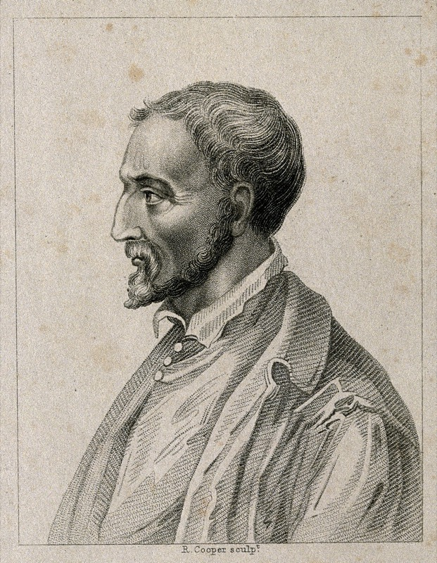
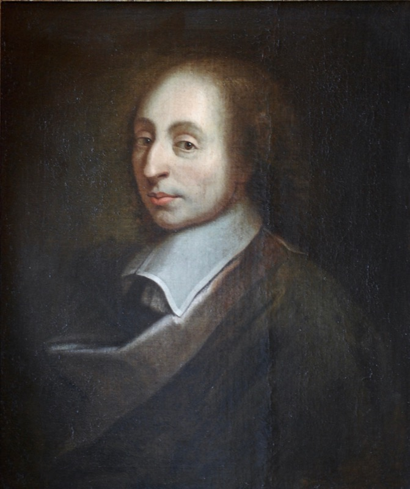
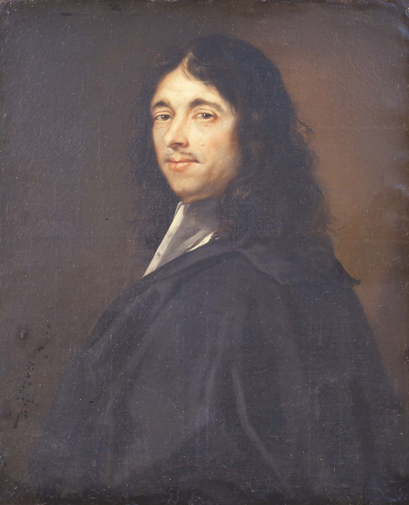
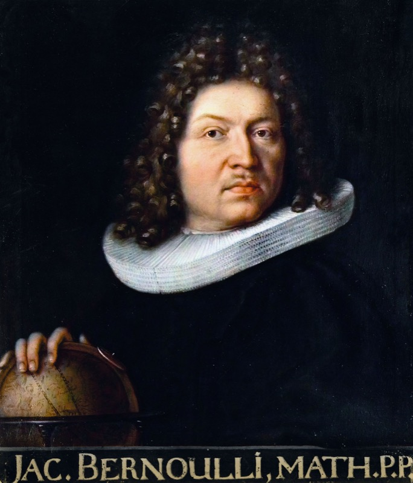
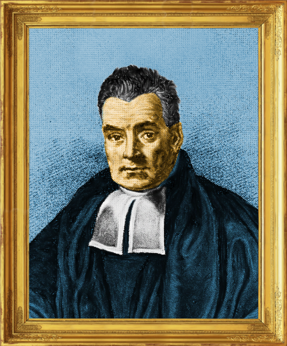
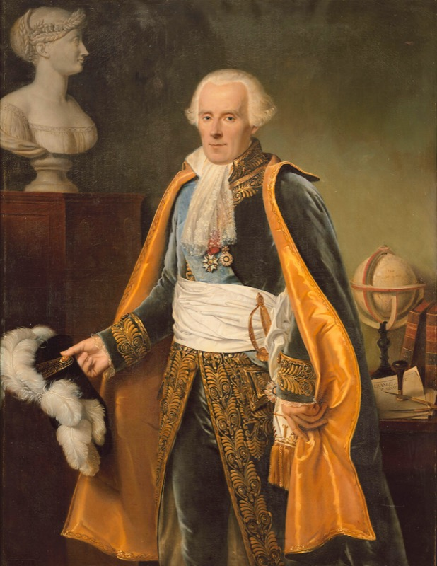

**Probability is the branch of mathematics that studies uncertainty.**

Whenever the world refuses to commit to a single answer — *will the drug
work? will it rain tomorrow? is this email spam? — *probability gives us
the language to say something useful about the alternatives. It is the
language behind weather forecasts, medical trials, insurance, gambling,
quantum mechanics, machine learning, and the routing algorithm that
delivered this page to your screen.

What's surprising is that probability is **young**. Mathematicians had
been doing calculus and geometry for centuries before anyone took
randomness seriously enough to write equations about it. The story of
how probability became a real subject is short, dramatic, and full of
gamblers, monks, astronomers, and one telephone engineer who quietly
changed the world. We'll meet a few of them before we begin.

## A short history

Click any name to read more.

::: {.callout-tip collapse="true"}
## ▶ **Gerolamo Cardano** (1501–1576) — the gambling doctor

::: {layout="[1,3]"}
{width="180px"}

A 16th-century Italian physician, mathematician, and chronic gambler.
Cardano wrote *Liber de Ludo Aleae* ("Book on Games of Chance") around
1560 — the **first known systematic treatment of probability**. He
worked out odds for dice, cards, and backgammon, and even discussed how
to detect cheating.

Embarrassed by the subject's disreputable connections, he kept the
manuscript private. It wasn't published until 1663 — almost 90 years
after his death. Cardano's instincts were correct, but the field had to
be re-discovered by mathematicians who took it more seriously.
:::

<small>*Stipple engraving by R. Cooper, [Wellcome
Collection](https://commons.wikimedia.org/wiki/File:Girolamo_Cardano._Stipple_engraving_by_R._Cooper._Wellcome_V0001004.jpg),
CC BY 4.0.*</small>
:::

::: {.callout-tip collapse="true"}
## ▶ **Blaise Pascal & Pierre de Fermat** (1654) — letters that founded a field

::: {layout-ncol="2"}
{width="220px"}

{width="220px"}
:::

A French nobleman named the **Chevalier de Méré** asked Pascal a
question about a dice game: *if a game has to stop early, how should the
pot be divided fairly between the players?*

Pascal didn't know. He wrote to **Fermat** in 1654, and the two
exchanged a series of letters working out the answer. In doing so they
invented — almost by accident — the foundations of probability theory:
expected value, the multiplication rule, the structure of compound
events. Six letters. The field begins here.

The problem they solved is still called the **problem of points**, and
their solution is still the right one.

<small>*Pascal portrait: copy of François Quesnel (1691), Palace of
Versailles
([Wikimedia](https://commons.wikimedia.org/wiki/File:Blaise_Pascal_Versailles.JPG),
CC BY 3.0). Fermat portrait: oil on canvas by Rolland Lefebvre, c. 1650
([Wikimedia](https://commons.wikimedia.org/wiki/File:Pierre_de_Fermat3.jpg),
public domain).*</small>
:::

::: {.callout-tip collapse="true"}
## ▶ **Jacob Bernoulli** (1654–1705) — the law of large numbers

::: {layout="[1,3]"}
{width="180px"}

Twenty years after Pascal and Fermat, the Swiss mathematician Jacob
Bernoulli took up the question: *if I flip a coin enough times, does
the fraction of heads actually converge to its true probability?*

Yes — and he proved it. His **Law of Large Numbers** (published
posthumously in 1713 in *Ars Conjectandi*) is the bridge between
**frequencies you can measure** and **probabilities you cannot**. It
turns probability from a calculator's curiosity into a science: the
empirical world *can* be used to estimate the unseen.

Every time you compute an average, you are leaning on his theorem.
:::

<small>*Portrait by his brother Niklaus Bernoulli, c. 1687
([Wikimedia](https://commons.wikimedia.org/wiki/File:Jakob_Bernoulli.jpg),
public domain).*</small>
:::

::: {.callout-tip collapse="true"}
## ▶ **Thomas Bayes** (1701–1761) — the rule that runs modern AI

::: {layout="[1,3]"}
{width="180px"}

An English Presbyterian minister and amateur mathematician, Bayes wrote
a paper on inverse probability — *given an observed effect, what was the
likely cause?* — and never published it. After his death, his friend
Richard Price found it in his papers and submitted it to the Royal
Society in 1763.

For 200 years it was a curiosity. Then statisticians, and later machine
learning researchers, noticed something: **Bayes' rule is the
mathematics of learning from evidence**. Every spam filter, every
medical diagnostic system, every Bayesian neural network is a child of
this short paper by a country minister who didn't think it worth
printing.

We'll meet his rule formally a few chapters from now. It deserves the
build-up.
:::

<small>*The only commonly-circulated portrait traditionally identified
as Thomas Bayes — its authenticity is **disputed** by historians (no
verified likeness of Bayes survives). Colorized version by Mark Riehl
([Wikimedia](https://commons.wikimedia.org/wiki/File:ThomasBayes.png),
CC BY-SA 4.0).*</small>
:::

::: {.callout-tip collapse="true"}
## ▶ **Pierre-Simon Laplace** (1749–1827) — the great consolidator

::: {layout="[1,3]"}
{width="180px"}

If Bayes was the seed, Laplace was the gardener. The French polymath
generalized Bayes' rule, applied probability to **astronomy, geodesy,
demographics, and law**, and wrote *Théorie Analytique des Probabilités*
(1812) — the first comprehensive textbook of the subject.

Laplace took probability seriously *as a science*. He used it to weigh
witness testimony in court cases, to estimate the population of France
from a sample, to argue that the solar system was stable. After
Laplace, no one could dismiss probability as gambler's mathematics
again.

A famous quip attributed to him: *"It is remarkable that a science
which began with the consideration of games of chance should have
become the most important object of human knowledge."*
:::

<small>*Portrait by Jean-Baptiste Paulin Guérin, 1838, Palace of
Versailles
([Wikimedia](https://commons.wikimedia.org/wiki/File:Pierre-Simon,_marquis_de_Laplace_(1745-1827)_-_Gu%C3%A9rin.jpg),
public domain).*</small>
:::

::: {.callout-tip collapse="true"}
## ▶ **Andrey Kolmogorov** (1903–1987) — the axioms

Until 1933, probability was a working subject without a formal
foundation. Different mathematicians used different definitions; the
field had paradoxes nobody could agree how to resolve.

Then a 30-year-old Soviet mathematician named **Andrey Kolmogorov**
published *Grundbegriffe der Wahrscheinlichkeitsrechnung* — a slim
monograph in which he proposed that probability theory should be built
on **three simple axioms** (the ones we'll meet later in this chapter)
plus measure theory.

Within a decade, the entire field had reorganised around his framework.
Every textbook written since 1933 — including this one — uses
Kolmogorov's axioms. **The formal foundation of probability is younger
than your grandparents.**

<small>*Photos of Kolmogorov are still under copyright; see the
[Oberwolfach Photo Collection](https://owpdb.mfo.de/) for licensed
portraits.*</small>
:::

::: {.callout-tip collapse="true"}
## ▶ **Claude Shannon** (1916–2001) — the bridge to machine learning

A telephone engineer at Bell Labs, Shannon noticed something nobody
else had: **information itself can be measured probabilistically**. His
1948 paper *A Mathematical Theory of Communication* introduced
**entropy** ($H = -\sum p_i \log p_i$), the bit, and the channel
capacity theorem.

Shannon's work is why you can make a phone call, store data on a hard
drive, compress a file, or train a neural network. Every loss function
in deep learning that has the word *cross-entropy* in it is a tribute to
him. He also liked to ride a unicycle through the Bell Labs corridors
while juggling.

If you take only one name from this list with you, take Shannon. He is
the reason probability and computation became inseparable.

<small>*Photos of Shannon are still under copyright. The Bell Labs and
MIT Museum archives hold the famous portraits.*</small>
:::

That's roughly four centuries of work, ending 75 years ago. The subject
is still young. With that history in your pocket, let's see what
probability actually *says*.

---

Luck. Coincidence. Randomness. Uncertainty. Risk. Doubt. Fortune. Chance.

You've probably heard these words countless times, but chances are they
were used in a vague, casual way. Despite probability being everywhere in
science and daily life, it can be deeply counterintuitive. The point of
this chapter is to put a precise meaning on the word **probability** —
precise enough that we can compute with it, simulate it, and bet on it.

We'll get there in five passes:

1. **A dialogue** that exposes the question hiding in plain sight.
2. **The frequentist view** — probability as long-run frequency.
3. **The subjective view** — probability as degree of belief.
4. **The formal framework** — sample space, events, axioms.
5. **A worked example** that ties the three views together.

You can skip the rigorous parts on the first read; click the **▶ Show the
math** boxes when you want them.

---

## A dialogue

The clearest way to see what's at stake is to listen to a short
conversation in a hospital. A relative is asking the nurse about a drug.

> **Relative:** Nurse, what is the probability that the drug will work?
>
> **Nurse:** I hope it works, we'll know tomorrow.
>
> **Relative:** Yes, but what is the *probability* that it will?
>
> **Nurse:** Each case is different. We have to wait.
>
> **Relative:** But out of a hundred patients treated under similar
> conditions, how many times would you expect it to work?
>
> **Nurse:** *(annoyed)* I told you, every person is different. For some
> it works, for some it doesn't.
>
> **Relative:** *(insisting)* Then tell me — if you had to *bet* whether
> it will work or not, which side of the bet would you take?
>
> **Nurse:** *(brightening)* I'd bet it will work.
>
> **Relative:** *(relieved)* OK — would you be willing to lose two
> dollars if it doesn't, and gain one dollar if it does?
>
> **Nurse:** *(exasperated)* What a sick thought! You are wasting my time!

Two important things happened here.

First, the relative tried **two completely different definitions** of
probability:

- *"Out of a hundred patients..."* — probability as a long-run
  **frequency**.
- *"Which side of the bet would you take?"* — probability as a
  **degree of belief** that can be elicited from someone's willingness to
  bet.

Second, the nurse refused both. She wasn't being unreasonable — she was
sensing that *this particular patient* is unique. That tension —
between the universal (population-level) and the particular
(this-case) — is the central problem the rest of this chapter
addresses.

::: {.callout-tip}
## The two-stage framework

There are really **two stages** to applying probability to a real
problem:

- **Stage 1 — Modelling (art).** Decide on a sample space and a
  probability law. There are no rigid rules here. Reasonable people will
  disagree about which model fits.
- **Stage 2 — Analysis (science).** Once the model is fixed, calculate
  probabilities. There is exactly one right answer; only your skill
  determines whether you find it.

Most "paradoxes" in probability are arguments about **Stage 1** disguised
as arguments about **Stage 2**. When two clever people get different
answers to the same problem, they almost never disagree about the math —
they disagree about which model is right.

The discipline of this chapter is to make Stage 1 explicit before
calculating anything.
:::

### A real disagreement: the two-child puzzle

Abstract claims about "Stage 1 vs Stage 2" only land once you've watched
two clever people disagree about a real problem. Here's one. It's
short, it's famous, and it has stumped working mathematicians.

> *You meet a stranger at a party. She tells you, "I have two children,
> and at least one of them is a boy." What is the probability that
> **both** of her children are boys?*

Take a moment. Write down your answer before reading on. Most people
say **1/2** — *"the other child is either a boy or a girl, those are
equally likely, so 1/2."* Others, after some thought, say **1/3**.
A few say "it depends" and look smug.

Here's the thing: **both 1/3 and 1/2 can be defended**, and the
disagreement is *entirely* about Stage 1 — what sample space should we
use? Once a sample space is fixed, every reasonable person gets the
same number out. Let's see this happen.

**Model A — "boy first, girl second" is a different family from "girl
first, boy second".** Birth order matters; the four equally likely
families are:

$$
\Omega_A = \{\text{BB},\; \text{BG},\; \text{GB},\; \text{GG}\}.
$$

The stranger told us "at least one is a boy", so we eliminate GG. Three
families remain — BB, BG, GB — and **all three are still equally likely**
(we haven't been given any reason to prefer one over the others). Of
those three, only BB has two boys. So $P(\text{both boys}) = 1/3$.

**Model B — we already met one of the children, and he was a boy.**
Maybe she said it because *the boy was standing next to her*. In that
case, the information isn't "at least one is a boy" — it's "*this
specific child* is a boy". The other child is then independent of the
one we met, and is a boy or a girl with equal probability. So
$P(\text{both boys}) = 1/2$.

**So what actually changed?** The two models aren't disagreeing about
the rules of probability — they're reasoning over *different sample
spaces*.

- **Model A** samples *families*. Start with the four equally likely
  families $\{\text{BB}, \text{BG}, \text{GB}, \text{GG}\}$, filter out
  the ones with no boy. Three families survive; only one is BB.
- **Model B** samples *a specific child* and asks about their sibling.
  Once one child has been identified as a boy, BG and GB are no longer
  two distinct outcomes — they collapse into "this boy plus one unknown
  sibling", and the sibling is a fresh coin flip.

The verbal sentence "at least one is a boy" is the *same* in both
stories, but it was *generated* by two different experiments. The sample
space follows the experiment, not the sentence.

Two models, two different answers. **Nobody has done arithmetic yet.**
The argument is happening at Stage 1.

We can confirm Model A's answer by simulation — pick the model and the
math falls out.

```{python}
# Model A: simulate many two-child families. Each child is independently
# B or G with probability 1/2. Among families with AT LEAST ONE boy, what
# fraction have TWO boys?
import numpy as np
rng = np.random.default_rng(seed=0)

n_families = 200_000
child_1 = rng.integers(0, 2, size=n_families)   # 1 = boy, 0 = girl
child_2 = rng.integers(0, 2, size=n_families)

at_least_one_boy = (child_1 == 1) | (child_2 == 1)
both_boys        = (child_1 == 1) & (child_2 == 1)

# Conditional frequency: among families with at least one boy,
# the fraction that have two boys.
p_model_A = both_boys.sum() / at_least_one_boy.sum()
print(f"Model A simulation: P(both boys | at least one boy) ≈ {p_model_A:.4f}")
print(f"Theoretical answer: 1/3 ≈ {1/3:.4f}")
```

```{python}
# Model B: simulate the same families, but now we 'meet' a uniformly random
# child from each family. Condition on the child we met being a boy, and ask
# whether the OTHER child is also a boy.

# Pick a random child to 'meet' from each family (0 = first, 1 = second)
which_met   = rng.integers(0, 2, size=n_families)
met_child   = np.where(which_met == 0, child_1, child_2)
other_child = np.where(which_met == 0, child_2, child_1)

met_a_boy   = (met_child == 1)
other_is_boy = (other_child == 1)

p_model_B = other_is_boy[met_a_boy].mean()
print(f"Model B simulation: P(other child is boy | met a boy) ≈ {p_model_B:.4f}")
print(f"Theoretical answer: 1/2 ≈ {1/2:.4f}")
```

The simulations agree with the theory **for whichever model you
chose**. The math is not in dispute. The model is.

::: {.callout-tip}
## The lesson

When someone claims a probability problem has a "right" answer and a
"wrong" answer, your first job is *not* to do the calculation. It's to
ask: **what sample space are you using, and why?** Almost every
probability paradox you'll meet — Monty Hall, the Sleeping Beauty
problem, the boy-girl paradox above, the envelope paradox — is a Stage
1 disagreement wearing a Stage 2 costume. The math is fine. The
modelling is what people are actually arguing about.

Throughout this book, whenever we set up a problem, we'll spell out
$\Omega$ first. It's a habit worth building.
:::

---

## The frequentist view: probability is what frequencies converge to

The frequentist answer to "what is probability?" is a recipe:

> **The probability of an event is the long-run frequency with which it
> happens, if you could repeat the experiment infinitely many times.**

This is intuitive for things you can repeat. *"This coin lands heads with
probability 0.5"* means: if you flip it enough times, the fraction
landing heads will get arbitrarily close to 0.5.

Let's actually watch that happen.

```{python}
import numpy as np
import matplotlib.pyplot as plt

rng = np.random.default_rng(seed=0)
n_flips = 10_000

# 1 = heads, 0 = tails. Fair coin so probability of heads = 0.5.
flips = rng.integers(0, 2, size=n_flips)

# Running frequency of heads after each flip
running_heads = np.cumsum(flips)
running_freq = running_heads / np.arange(1, n_flips + 1)

fig, ax = plt.subplots(figsize=(9, 4))
ax.plot(running_freq, color="C0", lw=1.2)
ax.axhline(0.5, color="C3", ls="--", lw=1, label="True probability = 0.5")
ax.set_xscale("log")
ax.set_xlabel("Number of flips (log scale)")
ax.set_ylabel("Fraction landing heads")
ax.set_title("A frequency converging to a probability")
ax.legend()
ax.set_ylim(0, 1)
plt.tight_layout()
plt.show()
```

Notice three things in the plot:

1. **The first 10 flips are all over the place.** The fraction is 0, or
   1, or 0.6, depending on what came up. Frequency is *not* probability
   when the sample is small.
2. **By the time we have 100+ flips, the fraction is close to 0.5 and
   stays close.** That's frequency *converging* to probability.
3. **It never settles exactly.** It zigzags around 0.5 forever, the
   zigzag getting smaller as $n$ grows.

The frequentist says: *"the probability of heads is 0.5"* is a statement
about that limit. The behaviour you see in the plot — the convergence —
is the empirical content of the claim.

::: {.callout-note collapse="true"}
## ▶ Show the math — The Law of Large Numbers, briefly

What we just observed is a special case of the **Law of Large Numbers**.

If $X_1, X_2, \ldots$ are independent flips of the same coin (so each
$X_i$ is 1 with probability $p$ and 0 with probability $1-p$), and we
form the sample mean

$$
\bar{X}_n = \frac{1}{n}\sum_{i=1}^{n} X_i,
$$

then the Law of Large Numbers says $\bar{X}_n \to p$ as $n \to \infty$.
There are two flavours: the **weak** law (convergence in probability) and
the **strong** law (almost-sure convergence). Both make rigorous the
intuitive idea that "the long-run frequency equals the probability".

A full proof needs Chebyshev's inequality (which we'll meet later) and
some measure theory. We'll come back to it in the chapter on limit
theorems. For now, the picture above is what you should keep in mind.
:::

### Where the frequentist view runs out of road

The recipe **only works for repeatable experiments**. Try applying it to
these statements:

- *"The probability that life exists on Mars is 30%."*
- *"There is a 70% chance the defendant is guilty."*
- *"The probability that the Iliad and Odyssey were composed by the
  same person is 90%."*

None of these can be repeated. There is exactly one Mars, one trial, one
historical fact about Homer. **There is no long-run frequency to point
at.** And yet people make statements like these every day, and they seem
to convey real information.

So either we say "those statements are nonsense" — or we expand our
notion of probability to cover them. That's what the subjective view
does.

---

## The subjective view: probability is a degree of belief

The subjective answer:

> **The probability of an event, for a given person at a given time, is
> revealed by the bets they are willing to take on it.**

Look at the dialogue again. The relative offered the nurse this bet:

- If the drug **works** → the nurse gains **\$1**.
- If the drug **does not work** → the nurse loses **\$2**.

What does it mean if she accepts? Let $p = P(\text{works})$ be her
belief that the drug works. Across many imagined runs of the bet, her
*average* (expected) profit is:

$$
E[\text{profit}] = p \cdot (\$1) \;+\; (1 - p) \cdot (-\$2) \;=\; 3p - 2
$$

A rational person only takes a bet whose expected profit is at least
zero (otherwise, on average, they lose money):

$$
3p - 2 \;\ge\; 0 \quad\Longrightarrow\quad p \;\ge\; \frac{2}{3} \;\approx\; 0.67
$$

So if the nurse accepts, she is implicitly saying she believes the drug
works with probability **at least 2/3 (≈ 67%)**. In practice, no one
takes a bet at the exact break-even point — people want a margin of
safety — so accepting a "lose \$2, win \$1" bet usually signals belief
closer to **80–90%**. She would have to be quite confident.

**The general rule.** If a bet pays you **\$W** when you win and costs
you **\$L** when you lose, you should only take it if your belief
satisfies

$$
p \;\ge\; \frac{L}{W + L}.
$$

The bigger the loss relative to the win, the higher your belief must
be:

| Win | Lose | Minimum belief to take the bet |
|-----|------|--------------------------------|
| \$1 | \$1  | 1/2 = 50% |
| \$1 | \$2  | 2/3 ≈ 67% *(the nurse's bet)* |
| \$1 | \$9  | 9/10 = 90% |

By offering bets of different shapes and watching which ones she accepts
or refuses, we can pin down her subjective probability to whatever
precision we like. **The bet she's willing to take *is* her belief, made
measurable.**

::: {.callout-tip collapse="true"}
## ▶ Where does the formula $p \ge L/(W+L)$ come from?

The break-even rule we just derived has a longer history than it looks:

- **Christiaan Huygens (1657)** introduced the idea of **expected
  value** in *De Ratiociniis in Ludo Aleae* — the first systematic
  probability text. The formula $E[\text{profit}] = pW - (1-p)L$ comes
  directly from his definition.
- **Jakob Bernoulli (1713)** — yes, the same Bernoulli from earlier in
  this chapter — proved the **Law of Large Numbers** in *Ars
  Conjectandi*. This is what justifies the rule across many bets:
  *average* profit and *expected* profit converge.
- **Daniel Bernoulli (1738)** — Jakob's nephew — pointed out in the
  *St. Petersburg paradox* that real people don't maximize expected
  money; they maximize **expected utility**. Losing \$2 hurts more than
  gaining \$2 helps. This is the formal reason a real nurse needs ~80–
  90% belief, not just the break-even ≥ 67%.

So the inequality is Huygens's; the reason it's reliable is Jakob
Bernoulli's; the reason humans don't bet right at the break-even line
is Daniel Bernoulli's.
:::

This view doesn't need repetition. It works for one-shot events, for
historical claims, for personal beliefs about the future.

A natural follow-up question is: *if two rational people start with
different beliefs but see the same evidence, do they end up agreeing?*
The answer is yes — and the formal mechanism for *how* beliefs update
is **Bayes' rule**, which we'll meet two chapters from now.

### Where the subjective view runs out of road

The standard objections are:

- *"Whose probability are we talking about?"* — different people, looking
  at the same evidence, can have different priors and so different
  posteriors. Frequentists find this disturbing; subjectivists say it's
  just honest.
- *"How do you elicit a prior in practice?"* — easier said than done. In
  ML this manifests as the **prior choice problem** in Bayesian models.

We will pragmatically use **whichever view fits the problem**. Don't pick
a side. For coin flips and dice, frequentist intuition is sharper. For
"how confident is this classifier?", subjective intuition is sharper. The
math underneath is the same.

---

## The formal framework

Both views — frequentist and subjective — agree on the **mathematical
structure** that any probability assignment has to obey. That structure
is:

1. A **sample space** $\Omega$ — the set of all possible outcomes.
2. A collection of **events** — subsets of $\Omega$ that we might want
   to assign probabilities to.
3. A **probability law** $P$ — a function that assigns a number to each
   event, obeying three axioms.

Three pieces. The art is in choosing the first two; the science is in
working with the third. Let's build each piece against a concrete
problem we can simulate.

### Concrete problem: rolling two dice

Throughout the rest of this chapter, we'll use a single running example.
You roll two ordinary six-sided dice. We'll define everything against
this.

```{python}
import pandas as pd

# Enumerate all 36 outcomes
outcomes = [(d1, d2) for d1 in range(1, 7) for d2 in range(1, 7)]
print(f"Total outcomes: {len(outcomes)}")
print("First few:", outcomes[:6])
```

### Sample space

The **sample space** $\Omega$ is the set of all possible outcomes of an
experiment. For two dice:

$$
\Omega = \{(1,1), (1,2), \ldots, (6,6)\}, \qquad |\Omega| = 36.
$$

Three things to insist on, and they're not optional:

1. **Mutually exclusive.** Each die roll produces exactly one outcome.
   You can't roll "(1,2) and (3,4) at the same time".
2. **Collectively exhaustive.** Every possible result of the experiment
   is in the list. You can't roll something not in $\Omega$.
3. **Right level of detail.** Detailed enough to answer the questions
   you care about, but no more.

::: {.callout-warning}
## Why mutual exclusivity matters

Compare these two attempted sample spaces for a single die roll:

- $\Omega_{\text{good}} = \{1, 2, 3, 4, 5, 6\}$ ✓
- $\Omega_{\text{bad}} = \{\text{"1 or 3"}, \text{"1 or 4"}, 2, 3, 5, 6\}$ ✗

The second one is **broken**. If you roll a 1, *which* outcome occurred —
"1 or 3" or "1 or 4"? The outcomes overlap (both contain a 1), so the
result of the experiment isn't uniquely defined. Probability calculations
break immediately: the axioms assume disjointness when adding.

A working sample space must let you point at exactly one outcome after
the experiment runs. No ambiguity.
:::

The third point is subtle. Watch:

```{python}
# Three different sample spaces for the SAME experiment of rolling two dice.

# (A) Too coarse: just the sum
omega_A = list(range(2, 13))
print(f"A) Sum only:  |Ω| = {len(omega_A)}, e.g. {omega_A[:5]}…")

# (B) The natural one: ordered pairs
omega_B = outcomes
print(f"B) Ordered pairs:  |Ω| = {len(omega_B)}, e.g. {omega_B[:3]}…")

# (C) Too fine: pairs plus colour of each die plus rotation angle on landing.
# We won't enumerate this — it's silly.
print("C) Ordered pairs + colour + rotation angle: |Ω| ≈ infinite, useless")
```

Sample space **A** is fine if the *only* question you'll ever ask is
about the sum. But it can't answer *"was the first die a 6?"*, because
that information has been thrown away.

Sample space **C** can answer everything but adds detail nobody cares
about — and the detail makes calculations harder, not easier.

Sample space **B** is the **right level**. It can answer every question
of interest and nothing more.

::: {.callout-tip}
## Choosing the sample space is part of modelling

There is no "the" sample space for an experiment. There is the sample
space *you choose* for the questions you want to answer. This is the
clearest example of Stage 1 (modelling = art) at work.
:::

### Events

An **event** is just a subset of $\Omega$. Some examples for our two
dice:

```{python}
omega = set(outcomes)

A = {(d1, d2) for d1, d2 in omega if d1 + d2 == 7}        # sum is 7
B = {(d1, d2) for d1, d2 in omega if d1 == d2}            # doubles
C = {(d1, d2) for d1, d2 in omega if d1 == 6}             # first die is 6
D = {(d1, d2) for d1, d2 in omega if d1 + d2 >= 10}       # sum ≥ 10

print(f"A = sum is 7        ({len(A)} outcomes): {sorted(A)}")
print(f"B = doubles         ({len(B)} outcomes): {sorted(B)}")
print(f"C = first die is 6  ({len(C)} outcomes): {sorted(C)}")
print(f"D = sum ≥ 10        ({len(D)} outcomes): {sorted(D)}")
```

Because events are sets, you can combine them with set operations.
Combining events gives you new events:

```{python}
# Sum is 7 OR doubles
A_or_B = A | B          # set union → "A or B"
# Sum is 7 AND first die is 6  (impossible — empty set)
A_and_C = A & C         # set intersection → "A and B"
# Sum is 7 but NOT doubles
A_not_B = A - B         # set difference

print(f"A ∪ B   ('sum is 7 OR doubles'):  {len(A_or_B)} outcomes")
print(f"A ∩ C   ('sum is 7 AND first die is 6'):  {len(A_and_C)} outcomes  →  {A_and_C}")
print(f"A \\ B   ('sum is 7 but not doubles'):  {len(A_not_B)} outcomes")
```

That's the entire grammar. Set union for "or", set intersection for
"and", set complement for "not". Probability theory inherits its grammar
from set theory.

::: {.callout-note collapse="true"}
## ▶ Show the math — Set algebra and De Morgan's laws

For any events $A$, $B$, $C \subseteq \Omega$, the following identities
hold and are used constantly:

**Commutative.** $A \cup B = B \cup A$, $\;\; A \cap B = B \cap A$.

**Associative.**
$(A \cup B) \cup C = A \cup (B \cup C)$,
$\;\; (A \cap B) \cap C = A \cap (B \cap C)$.

**Distributive.**
$A \cap (B \cup C) = (A \cap B) \cup (A \cap C)$,
$\;\; A \cup (B \cap C) = (A \cup B) \cap (A \cup C)$.

**De Morgan's laws** (the most-used one in proofs):

$$
(A \cup B)^c = A^c \cap B^c, \qquad (A \cap B)^c = A^c \cup B^c.
$$

In words: "not (A or B)" = "(not A) and (not B)", and the dual.

**Why we sometimes need a $\sigma$-algebra.** When $\Omega$ is finite or
countable, *every* subset can be an event, and we don't worry about it.
But when $\Omega$ is uncountable (e.g. the real line), it turns out you
can't consistently assign probabilities to *every* subset — pathological
sets break additivity. So we restrict events to a special collection
called a **$\sigma$-algebra** (closed under complements and countable
unions). For the purposes of this book, you can treat "event" and
"subset of $\Omega$" as synonymous, and trust that the measure-theoretic
fine print works out.
:::

::: {.callout-tip collapse="true"}
## ▶ Show the math — Different sizes of infinity (Hilbert's Hotel)

If "countable vs uncountable" sounds vague, here's the picture that
makes it concrete.

**Hilbert's Hotel** has infinitely many rooms — one for each natural
number — and they're all full. A new guest arrives. Can the manager fit
them in?

Yes! Move the guest in room 1 to room 2. Move room 2 to room 3. In
general, move room $n$ to room $n+1$. Room 1 is now free. The new
guest checks in.

What if **infinitely many** new guests arrive? Still fine. Move every
current guest from room $n$ to room $2n$. All odd-numbered rooms are
now empty. Room any number of new guests in them.

This is what mathematicians mean by **countably infinite**: a set is
countable if you can put its elements in 1-to-1 correspondence with
the natural numbers $\{1, 2, 3, \ldots\}$. The integers $\mathbb{Z}$
are countable. The rationals $\mathbb{Q}$ are countable (Cantor's
zigzag argument lists them all). Even the algebraic numbers are
countable.

But here's the punchline. Hilbert's Hotel **cannot** fit the **real
numbers** $\mathbb{R}$. Cantor proved this in 1891 with his famous
**diagonal argument**: assume you have a list of all reals between 0
and 1; construct a new real that differs from the $n$-th entry in its
$n$-th decimal digit; this new real is on the list (we said the list
was complete) but cannot be on the list (it differs from every entry).
Contradiction. So no list exists.

This means there are **at least two genuinely different sizes of
infinity**: the countable (the rooms in Hilbert's Hotel) and the
uncountable (the real line). It also means probability theory on
$\mathbb{R}$ is fundamentally different from probability on a
finite set — which is why we'll need calculus, integration, and
measure theory once we get to continuous distributions.

That's all the measure theory we need for now. Welcome to the deep end.
:::

### Probability law: the three axioms

A **probability law** $P$ is a function from events to numbers that
satisfies three axioms:

::: {.callout-important}
## The Kolmogorov axioms

For any events $A, B$ in a sample space $\Omega$:

- **(A1) Non-negativity.** $\;\;P(A) \ge 0$.
- **(A2) Normalization.** $\;\;P(\Omega) = 1$.
- **(A3) Additivity.** If $A$ and $B$ are disjoint ($A \cap B =
  \emptyset$), then
  $$ P(A \cup B) = P(A) + P(B). $$

  More generally, for a countably infinite sequence of pairwise disjoint
  events $A_1, A_2, \ldots$:
  $$ P\!\left(\bigcup_{i=1}^{\infty} A_i\right) = \sum_{i=1}^{\infty} P(A_i). $$
:::

Three axioms. That's the whole foundation. Everything else in probability
theory — every formula, every theorem, every proof — follows from these
three.

Let's verify them on our dice.

```{python}
# For fair dice, each of the 36 outcomes has probability 1/36.
# We define the probability law as: for any event E, P(E) = |E| / 36.

def P(event):
    return len(event) / 36

# (A1) Non-negativity — trivially true since |event| ≥ 0
print(f"(A1) P(A) = {P(A):.4f} ≥ 0 ✓")

# (A2) Normalization
print(f"(A2) P(Ω) = {P(omega)} = 1 ✓")

# (A3) Additivity. Pick two disjoint events.
# E = "sum is 7", F = "sum is 11" — these can't both happen.
E = {(d1, d2) for d1, d2 in omega if d1 + d2 == 7}
F = {(d1, d2) for d1, d2 in omega if d1 + d2 == 11}
print(f"     E ∩ F = {E & F} (disjoint ✓)")
print(f"     P(E) + P(F) = {P(E):.4f} + {P(F):.4f} = {P(E) + P(F):.4f}")
print(f"     P(E ∪ F)    = {P(E | F):.4f}")
print(f"     Equal ✓")
```

That's it. The rest of probability theory is just consequences of these
three rules.

::: {.callout-note collapse="true"}
## ▶ Show the math — Useful consequences of the axioms

From the three axioms alone, we can derive a long list of useful facts.
Here are the most-used ones, with proofs.

**1. $P(\emptyset) = 0$.**

*Proof.* $\Omega = \Omega \cup \emptyset$ and these are disjoint, so by
(A3): $P(\Omega) = P(\Omega) + P(\emptyset)$, which gives $P(\emptyset)
= 0$. $\blacksquare$

**2. Complement rule: $P(A^c) = 1 - P(A)$.**

*Proof.* $A$ and $A^c$ are disjoint and $A \cup A^c = \Omega$. By (A3):
$P(A) + P(A^c) = P(\Omega) = 1$. Rearranging gives the claim.
$\blacksquare$

**3. Upper bound: $P(A) \le 1$.**

*Proof.* From (2), $P(A) = 1 - P(A^c) \le 1$ since $P(A^c) \ge 0$ by
(A1). $\blacksquare$

**4. Monotonicity: if $A \subseteq B$, then $P(A) \le P(B)$.**

*Proof.* Write $B$ as a disjoint union: $B = A \cup (B \cap A^c)$. By
(A3): $P(B) = P(A) + P(B \cap A^c) \ge P(A)$, since
$P(B \cap A^c) \ge 0$. $\blacksquare$

**5. Inclusion–exclusion (two events):**

$$
P(A \cup B) = P(A) + P(B) - P(A \cap B).
$$

*Proof.* Decompose $A \cup B$ into three disjoint pieces:
$$
A \cup B = (A \cap B^c) \;\sqcup\; (A^c \cap B) \;\sqcup\; (A \cap B).
$$

Apply (A3) and rearrange. $\blacksquare$

**6. Union bound (Boole's inequality):**

$$
P(A \cup B) \le P(A) + P(B), \qquad
P\!\left(\bigcup_i A_i\right) \le \sum_i P(A_i).
$$

*Proof.* For two events, this is (5) plus $P(A \cap B) \ge 0$. The
general case follows by induction on the number of events (and a small
extra argument for countable unions). $\blacksquare$

The union bound looks weak — it just throws away the intersection — but
it's used constantly in machine learning theory because it requires no
assumptions about how the events relate to each other.
:::

---

## Sequential experiments and tree diagrams

Many real experiments unfold **in stages**. You don't roll all your dice
at once — you roll the first, see what happens, then roll the second.
You don't measure all your sensor outputs at once — readings come in
over time. You don't read an email and decide it's spam in a single
glance — you check the sender, then the subject line, then the body.

For these step-by-step experiments, the cleanest representation is a
**tree diagram**. Each branch from a node represents a possible outcome
at that stage; each path from root to leaf is one complete sequence of
outcomes. The set of all leaves is the sample space.

Let's draw one. We'll use the simplest sequential experiment that's
still interesting: **flipping a fair coin three times**.

```{python}
import matplotlib.pyplot as plt
from matplotlib.patches import FancyArrowPatch

fig, ax = plt.subplots(figsize=(11, 6))

# Each level's x positions and labels
def draw_tree(ax):
    # Layout: stage in y, paths in x
    # Stage 0 (root) at y=3, then stage 1 at y=2, stage 2 at y=1, stage 3 at y=0
    nodes = {
        "root": (4, 3),
        "H":   (2, 2),  "T":   (6, 2),
        "HH":  (1, 1),  "HT":  (3, 1),  "TH":  (5, 1),  "TT":  (7, 1),
        "HHH": (0.5, 0), "HHT": (1.5, 0),
        "HTH": (2.5, 0), "HTT": (3.5, 0),
        "THH": (4.5, 0), "THT": (5.5, 0),
        "TTH": (6.5, 0), "TTT": (7.5, 0),
    }
    edges = [
        ("root", "H"), ("root", "T"),
        ("H", "HH"), ("H", "HT"), ("T", "TH"), ("T", "TT"),
        ("HH", "HHH"), ("HH", "HHT"), ("HT", "HTH"), ("HT", "HTT"),
        ("TH", "THH"), ("TH", "THT"), ("TT", "TTH"), ("TT", "TTT"),
    ]

    # Draw edges first (under nodes)
    for a, b in edges:
        ax.plot([nodes[a][0], nodes[b][0]], [nodes[a][1], nodes[b][1]],
                color="#94a3b8", lw=1.5, zorder=1)

    # Draw nodes
    for name, (x, y) in nodes.items():
        if name == "root":
            ax.scatter(x, y, s=600, c="#1f2937", zorder=3)
            ax.annotate("start", xy=(x, y+0.18), ha="center", fontsize=10, color="#1f2937")
        elif len(name) == 3:
            # Leaf — colour by number of heads
            n_heads = name.count("H")
            shades = ["#fef3c7", "#fde68a", "#fcd34d", "#f59e0b"]
            ax.scatter(x, y, s=900, c=shades[n_heads],
                       edgecolor="#92400e", linewidth=1.5, zorder=3)
            ax.annotate(name, xy=(x, y), ha="center", va="center",
                        fontsize=10, fontweight="bold", color="#78350f", zorder=4)
        else:
            ax.scatter(x, y, s=600, c="white", edgecolor="#475569",
                       linewidth=1.5, zorder=3)
            ax.annotate(name, xy=(x, y), ha="center", va="center",
                        fontsize=9, color="#1f2937", zorder=4)

    # Stage labels on the left
    for stage_y, label in [(3, "Start"), (2, "Toss 1"), (1, "Toss 2"), (0, "Toss 3")]:
        ax.annotate(label, xy=(-0.4, stage_y), ha="right", va="center",
                    fontsize=10, color="#475569", style="italic")

    ax.set_xlim(-1, 8.5)
    ax.set_ylim(-0.5, 3.5)
    ax.axis("off")
    ax.set_title("Tree diagram: three coin tosses → 8 leaf outcomes",
                 fontsize=12, pad=10)

draw_tree(ax)
plt.tight_layout()
plt.show()
```

A few things this picture makes obvious:

- **Sample space is the leaves.**
  $\Omega = \{\text{HHH, HHT, HTH, HTT, THH, THT, TTH, TTT}\}$, so
  $|\Omega| = 2^3 = 8$. (More generally: $2^n$ leaves for $n$ tosses.)

- **Events are sets of leaves.** "Exactly 2 heads" =
  $\{\text{HHT, HTH, THH}\}$ (the medium-shaded leaves above).
  "At least 1 head" = all leaves except $\{\text{TTT}\}$.

- **Probabilities follow paths.** Each branch in a fair coin tree is
  taken with probability $1/2$, and the probability of reaching a
  specific leaf is the product along the path: $(1/2)(1/2)(1/2) = 1/8$.
  Multiply along branches; add across branches.

Let's verify by computing some probabilities directly from the tree:

```{python}
from itertools import product

# Generate all leaves
leaves = list(product("HT", repeat=3))
print(f"Sample space size: {len(leaves)}")
print(f"All leaves: {[''.join(l) for l in leaves]}")

# Each leaf has probability (1/2)^3 = 1/8 since each toss is independent
# (we'll formalise 'independence' next chapter; for now treat the tree
# as visual evidence)
p_leaf = 1 / 8

# Event A: exactly 2 heads
event_A = [l for l in leaves if l.count("H") == 2]
print(f"\nP(exactly 2 heads) = {len(event_A)}/8 = {len(event_A)/8}")
print(f"  leaves: {[''.join(l) for l in event_A]}")

# Event B: at least 1 head
event_B = [l for l in leaves if l.count("H") >= 1]
print(f"\nP(at least 1 head) = {len(event_B)}/8 = {len(event_B)/8}")

# Event C: all three are the same
event_C = [l for l in leaves if l.count("H") in (0, 3)]
print(f"\nP(all same) = {len(event_C)}/8 = {len(event_C)/8}")
```

Trees aren't just pictures — they're a **systematic way to enumerate**
sequential outcomes without missing any or double-counting. Whenever a
problem can be described as "first this happens, then that, then…",
draw the tree first. The math becomes obvious.

::: {.callout-tip}
## Why we'll keep coming back to trees

Trees are the natural picture for **conditional probability** (the next
chapter). The branches into a node from above are the conditioning;
the branches out are the conditional probabilities given that you've
arrived. Bayes' rule is just "go up the tree and re-weight". We'll
build up to that — but the tree you just drew is the seed.
:::

---

## Tying it together: simulating the dice

We've defined a model: $\Omega$, events, probability law. **Stage 1
done.** Now we do **Stage 2** (analysis) and check it against
simulation.

> *Question.* What's the probability that the sum of two dice is 7?

Let's compute it three ways and watch them agree.

::: {.callout-important}
## The classical probability formula

When all outcomes in a finite sample space are **equally likely**, the
probability of any event $A$ is simply

$$
P(A) \;=\; \frac{|A|}{|\Omega|} \;=\; \frac{\text{number of outcomes in } A}{\text{total number of outcomes}}.
$$

This is sometimes called the **discrete uniform probability law**, and
it's the workhorse formula behind half the probability problems you'll
ever solve. It reduces probability to a counting problem — which is why
combinatorics (Part II of the book) gets so useful, so quickly.

For our two dice, every outcome has probability $1/36$, so $P(\text{sum}=7)
= |A|/36$. We just need to count the cells.
:::

**Way 1 — Counting (analytical).**

```{python}
# By the equally-likely-outcomes formula
event_sum_7 = {(d1, d2) for d1, d2 in omega if d1 + d2 == 7}
p_analytical = len(event_sum_7) / 36
print(f"Analytical P(sum=7) = {len(event_sum_7)}/36 = {p_analytical:.6f}")
print(f"                    = {p_analytical:.4%}")
```

**Way 2 — Simulation (frequentist).**

```{python}
# Roll a million pairs of dice and count the fraction with sum = 7.
n_rolls = 1_000_000
d1 = rng.integers(1, 7, size=n_rolls)
d2 = rng.integers(1, 7, size=n_rolls)
sums = d1 + d2

p_empirical = (sums == 7).mean()
print(f"Empirical P(sum=7)  = {p_empirical:.6f}  (from {n_rolls:,} rolls)")
```

**Way 3 — Picture (where you can just *see* the answer).**

```{python}
# Visualize the 6×6 grid. Highlight outcomes whose sum is 7.
fig, ax = plt.subplots(figsize=(5.5, 5.5))
for d1 in range(1, 7):
    for d2 in range(1, 7):
        is_7 = (d1 + d2 == 7)
        color = "#3b82f6" if is_7 else "#e5e7eb"
        ax.scatter(d1, d2, s=900, c=color, edgecolor="white", linewidth=2)
        ax.annotate(f"{d1+d2}", xy=(d1, d2), ha="center", va="center",
                    fontsize=11, color="white" if is_7 else "#374151",
                    fontweight="bold")

ax.set_xticks(range(1, 7))
ax.set_yticks(range(1, 7))
ax.set_xlabel("Die 1")
ax.set_ylabel("Die 2")
ax.set_title("Each cell shows the sum.  Blue = sum is 7.\n6/36 cells highlighted.")
ax.set_xlim(0.5, 6.5)
ax.set_ylim(0.5, 6.5)
ax.set_aspect("equal")
ax.grid(False)
plt.tight_layout()
plt.show()
```

Six cells out of thirty-six are blue. $6/36 = 1/6 \approx 0.1667$. The
analytical answer, the simulation, and the picture all agree.

That triangulation — formula, simulation, picture — is the working style
we'll use for the entire book. Whenever you're unsure of an answer:
**simulate it. Picture it. Then prove it.**

---

## Three things you should take away

1. **Probability has two interpretations and one math.** Frequentist
   probability is a long-run frequency; subjective probability is a
   degree of belief. They argue about Stage 1 (modelling). They agree on
   Stage 2 (the math).

2. **Every probability calculation rests on three things** — sample
   space, events, axioms. Specify the first two carefully; the third is
   non-negotiable. Most "paradoxes" come from being sloppy about $\Omega$.

3. **Simulation is your safety net.** When in doubt, write a population,
   simulate it, count what's in each bucket. The closed-form answers in
   the rest of this book are descriptions of those counts.

---

## Exercises

1. **Build a sample space.** Define $\Omega$ for the experiment "draw
   one card from a standard 52-card deck". Then describe the following
   events as subsets:
   (a) the card is a heart;
   (b) the card is a face card (J, Q, K);
   (c) the card is a red ace.
   Compute $P(\cdot)$ for each, assuming all cards are equally likely.

2. **Frequentist limit.** Modify the coin-convergence simulation above
   to use a *biased* coin with $p = 0.3$. Plot the running frequency.
   How many flips do you need before the frequency is within 0.01 of
   the true value? Run it 5 times — does the answer vary?

3. **Subjective limit.** In the Alice/Bob simulation, what happens if
   Alice's prior is *wrong* and very confident — say, Beta(500, 500)
   meaning "I'm extremely sure this coin is fair"? How many flips before
   she's overruled by the data? What does this tell you about strong
   priors in Bayesian inference?

4. **Check an axiom.** Pick any two events from the dice example
   (e.g. $E$ = "sum is even" and $F$ = "first die is odd"). Verify
   inclusion–exclusion: compute $P(E)$, $P(F)$, $P(E \cap F)$, and
   $P(E \cup F)$ separately, and check that $P(E \cup F) = P(E) + P(F)
   - P(E \cap F)$.
