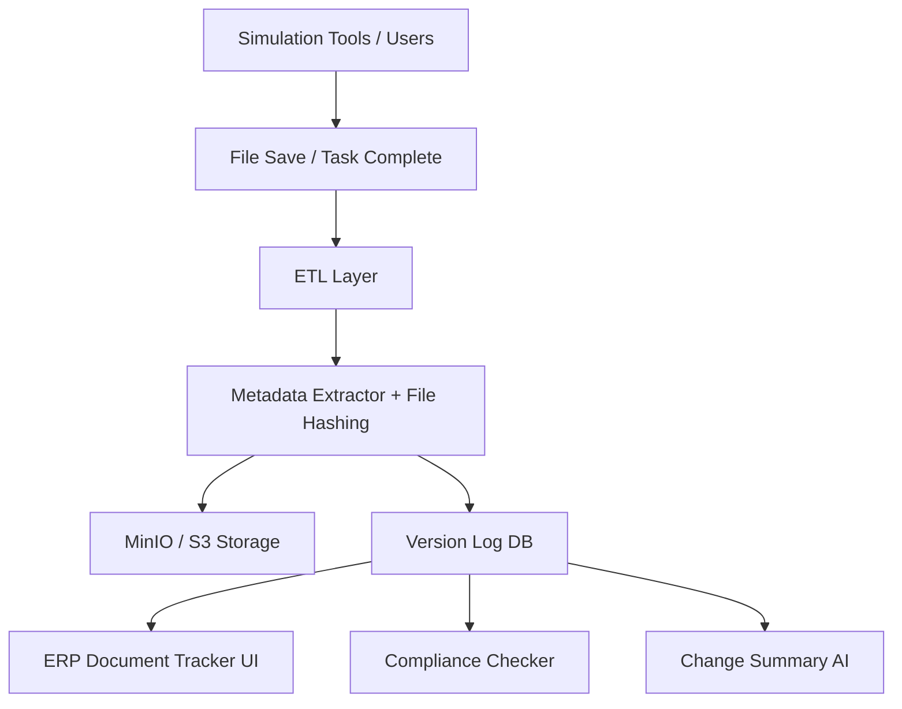

```mermaid
graph TD
    A[Simulation Tools / Users] --> B[File Save / Task Complete]
    B --> C[ETL Layer]
    C --> D[Metadata Extractor + File Hashing]
    D --> E[MinIO / S3 Storage]
    D --> F[Version Log DB]

    F --> G[ERP Document Tracker UI]
    F --> H[Compliance Checker]
    F --> I[Change Summary AI]
```