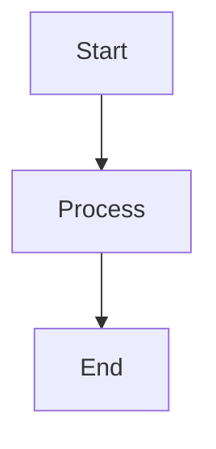

# Mermaid Diagram Converter

Cross-platform scripts for converting Mermaid diagrams (.mmd files) to images on macOS, Linux, and Windows.

## Quick Start

### 1. Generate OS-specific configuration

```bash
./generate-puppeteer-config.sh
```

### 2. Convert diagrams

```bash
# Convert single file to PNG
./convert-mermaid.sh diagram.mmd

# Convert to specific format
./convert-mermaid.sh diagram.mmd output.svg
./convert-mermaid.sh diagram.mmd output.pdf

# High resolution conversions
./convert-mermaid.sh diagram.mmd --hd      # 2048x1536 HD
./convert-mermaid.sh diagram.mmd --4k      # 3840x2160 4K
./convert-mermaid.sh diagram.mmd --custom 1920x1080

# Convert all .mmd files to PNG (high resolution by default)
./convert-mermaid.sh --all
```

## Files

- `generate-puppeteer-config.sh` - Auto-detects Chrome/Chromium path for your OS
- `convert-mermaid.sh` - Main conversion script with multiple options
- `puppeteer-config.json` - Generated configuration file (OS-specific Chrome path)

## Supported Platforms

### macOS

Automatically detects Chrome at:

- `/Applications/Google Chrome.app/Contents/MacOS/Google Chrome`
- `/Applications/Chromium.app/Contents/MacOS/Chromium`

### Linux

Automatically detects Chrome at:

- `/usr/bin/google-chrome`
- `/usr/bin/google-chrome-stable`
- `/usr/bin/chromium-browser`
- `/usr/bin/chromium`
- `/snap/bin/chromium`

### Windows (WSL)

Automatically detects Chrome at:

- `/mnt/c/Program Files/Google/Chrome/Application/chrome.exe`
- `/mnt/c/Program Files (x86)/Google/Chrome/Application/chrome.exe`

## Usage Examples

```bash
# Basic conversion
./convert-mermaid.sh flowchart.mmd                    # → flowchart.png (2048x1536)
./convert-mermaid.sh flowchart.mmd diagram.svg        # → diagram.svg
./convert-mermaid.sh flowchart.mmd --pdf              # → flowchart.pdf

# High resolution options
./convert-mermaid.sh flowchart.mmd --hd               # → flowchart_hd.png (2048x1536)
./convert-mermaid.sh flowchart.mmd --4k               # → flowchart_4k.png (3840x2160)
./convert-mermaid.sh flowchart.mmd --custom 1920x1080 # → flowchart_1920x1080.png

# Convert all files
./convert-mermaid.sh --all                            # All .mmd → .png (high res)

# Help
./convert-mermaid.sh --help
```

## Requirements

1. **Node.js** and **npm**
2. **Mermaid CLI**: `npm install -g @mermaid-js/mermaid-cli`
3. **Chrome or Chromium browser**

## Troubleshooting

### Chrome/Chromium not found

Run the config generator to detect your browser:

```bash
./generate-puppeteer-config.sh
```

### Permission denied

Make scripts executable:

```bash
chmod +x *.sh
```

### Diagram syntax errors

Ensure your .mmd files contain valid Mermaid syntax:



## Example Diagrams

This directory contains example diagrams:

- `permute_apple.mmd` - Permutation visualization
- `counting.mmd` - Counting principles diagram
- `counting_fixed.mmd` - Fixed counting example

## Output Formats

- **PNG** - Default, good for web and documents
- **SVG** - Vector format, scalable and small file size
- **PDF** - Best for print and professional documents
